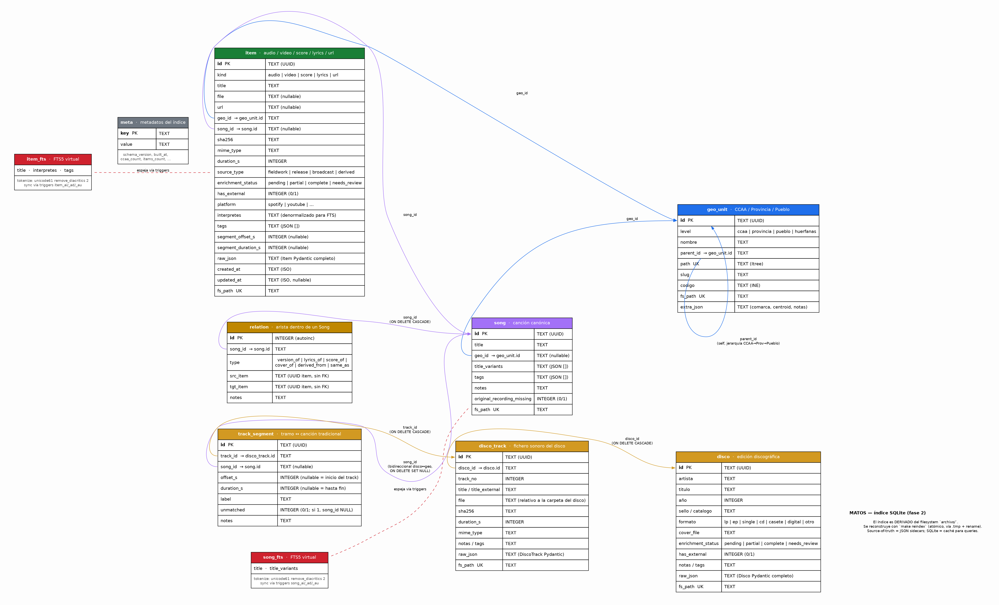

# Base de datos

El índice SQLite (`/data/index/matos.db`) se construye desde el filesystem
con `make reindex` y se consulta desde la API.

!!! warning "El índice es **derivado**"
    Nunca leer/escribir directamente sobre el SQLite. La fuente de verdad
    son los JSON en `archivo/`. Para cambios: editar JSON → `make reindex`.

## Diagrama ER

{ loading=lazy }

Regenerar con `make db-diagram` tras modificar
[`schema.sql`](https://github.com/juananmgz/matos/blob/main/backend/matos/index/schema.sql).

## Tablas principales

### `geo_unit`

Jerarquía CCAA → Provincia → Pueblo. Auto-referencial vía `parent_id`. El nivel `huerfanas` agrupa canciones cuyo origen geográfico se conoce sólo parcialmente.

| Campo | Tipo | Notas |
|---|---|---|
| `id` | TEXT (UUID) | PK |
| `level` | TEXT | `ccaa` \| `provincia` \| `pueblo` \| `huerfanas` |
| `parent_id` | TEXT FK | `→ geo_unit.id` (NULL para CCAA) |
| `path` | TEXT | ltree-like: `andalucia.granada.pampaneira` |
| `slug` | TEXT | Carpeta ASCII |
| `codigo` | TEXT | INE (5 dígitos pueblo, 2 provincia) |
| `extra_json` | TEXT | comarca, subcomarca, centroid, notas |

### `song`

Canción canónica que agrupa items.

| Campo | Tipo | Notas |
|---|---|---|
| `id` | TEXT (UUID) | PK |
| `title` | TEXT | Título canónico |
| `geo_id` | TEXT FK | Origen geográfico de la canción |
| `title_variants` | TEXT | JSON array |
| `tags` | TEXT | JSON array |
| `original_recording_missing` | INTEGER (0/1) | `1` = stub creado desde `TrackSegment` sin grabación de campo |

### `item`

Unidad atómica del archivo: audio / video / score / lyrics / url.

Columnas extraídas para indexar rápido + `raw_json` con el `Item` Pydantic
completo (la API devuelve `raw_json`).

```sql title="Columnas indexadas"
kind, title, file, url, geo_id, song_id,
sha256, mime_type, duration_s,
source_type, enrichment_status, has_external, platform,
interpretes,    -- denormalizado para FTS
tags,           -- JSON array
segment_offset_s, segment_duration_s,
created_at, updated_at, fs_path
```

### `relation`

Aristas dirigidas dentro de un Song. Tipos:

- `version_of` — interpretación distinta de la misma canción.
- `lyrics_of` — letra que corresponde a una grabación.
- `score_of` — partitura que transcribe una grabación.
- `cover_of` — versión comercial de otra.
- `derived_from` — remix / transcripción / cover de cover.
- `same_as` — misma grabación en distintas plataformas.

!!! note "Sin FK explícitas en `src_item`/`tgt_item`"
    Razón: SQLite no soporta `ON DELETE CASCADE` con multi-source FK.
    La integridad la garantiza el rebuild atómico desde JSON.

### `disco`

Edición discográfica (LP/CD/EP/single/digital) de folklore o folk moderno.

| Campo | Tipo | Notas |
|---|---|---|
| `id` | TEXT (UUID) | PK |
| `artista` | TEXT | |
| `titulo` | TEXT | |
| `año` | INTEGER | |
| `sello` | TEXT | |
| `catalogo` | TEXT | |
| `formato` | TEXT | `lp` \| `ep` \| `single` \| `cd` \| `casete` \| `digital` \| `otro` |
| `cover_file` | TEXT | Ruta relativa a la carpeta del disco |
| `enrichment_status` | TEXT | `pending` \| `partial` \| `complete` \| `needs_review` |
| `has_external` | INTEGER (0/1) | |
| `raw_json` | TEXT | Volcado completo del `Disco` Pydantic |
| `fs_path` | TEXT UK | Ruta del `_disco.json` |

### `disco_track`

Un fichero sonoro dentro de un disco. Contiene N segmentos.

| Campo | Tipo | Notas |
|---|---|---|
| `id` | TEXT (UUID) | PK |
| `disco_id` | TEXT FK | `→ disco.id` ON DELETE CASCADE |
| `track_no` | INTEGER | Número de pista |
| `title` | TEXT | Título del archivo curado |
| `title_external` | TEXT | Título tal como aparece en la plataforma |
| `file` | TEXT | Ruta del audio relativa a la carpeta del disco |
| `sha256` | TEXT | |
| `duration_s` | INTEGER | |
| `mime_type` | TEXT | |
| `raw_json` | TEXT | Volcado completo del `DiscoTrack` Pydantic |
| `fs_path` | TEXT UK | Ruta del `.track.json` |

### `track_segment`

Tramo temporal de un track mapeado a una `Song` del archivo geográfico.

| Campo | Tipo | Notas |
|---|---|---|
| `id` | TEXT (UUID) | PK |
| `track_id` | TEXT FK | `→ disco_track.id` ON DELETE CASCADE |
| `song_id` | TEXT FK | `→ song.id` ON DELETE SET NULL (nullable) |
| `offset_s` | INTEGER | Nullable = empieza al inicio del track |
| `duration_s` | INTEGER | Nullable = hasta el final |
| `label` | TEXT | |
| `unmatched` | INTEGER (0/1) | `1` si no se pudo asociar a ninguna `Song` |
| `notes` | TEXT | |

La bidireccionalidad disco↔geo se resuelve por SQL: "qué tracks contienen esta `Song`" → `SELECT * FROM track_segment WHERE song_id = ?`.

## FTS5

Dos tablas virtuales sincronizadas vía triggers:

- `item_fts` espeja `(title, interpretes, tags)` → búsqueda full-text de items.
- `song_fts` espeja `(title, title_variants)` → búsqueda de canciones.

Tokenización: `unicode61 remove_diacritics 2` → "Maria" encuentra "María".

## Reconstrucción atómica

`build_index()` escribe a `<db>.tmp`, hace commit, y solo entonces hace
`rename` sobre el destino. Si hay errores Pydantic durante el walk, el
índice anterior queda intacto.
