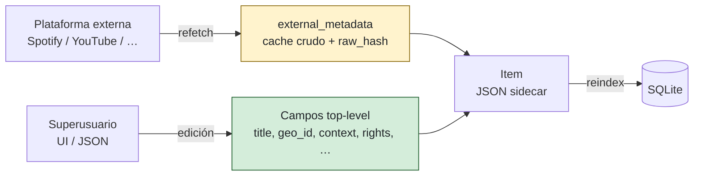

# Modelo de metadatos

## Dos capas por item

| Capa | Quién escribe | Cuándo |
|---|---|---|
| `external_metadata` | API de la plataforma | `POST /api/items/{id}/refetch` |
| Top-level (`title`, `geo_id`, …) | Superusuario | Edición manual |

!!! danger "Nunca mezclar las capas"
    Editar `external_metadata` a mano lleva a inconsistencias entre el
    `raw_hash` y el contenido. El detector de cambios externos (fase 11)
    deja de funcionar.

## Estados de enriquecimiento

| Estado | Significado |
|---|---|
| `pending` | Solo `external_metadata`, sin curación. |
| `partial` | Algún campo curado, faltan requeridos para `complete`. |
| `complete` | Todos los campos requeridos rellenos. |
| `needs_review` | El external cambió desde la última edición; revisar diff. |

## Reglas

1. El **título legible** del archivo va en `title`. El título tal-como-aparece-en-
   la-plataforma se preserva en `source.release.track_title_external`.
2. **`geo_id`** es el origen geográfico de la **canción**, no la ubicación del
   artista (ver [caso Ringorrango](../casos-de-uso/ringorrango.md)).
3. **`context.interprete`** puede coincidir con `source.release.artist` o no
   (recopilaciones, fieldwork reissues, etc.).
4. Cuando un media externo contiene **varias canciones**, crear ítems hermanos
   con la misma `url` y distinto `segment.offset_s` / `segment.duration_s`.
5. **`enrichment.notes`** es texto libre — documentar la lógica del enriquecimiento
   (códigos del artista, fuentes consultadas, contraste con otras grabaciones).
