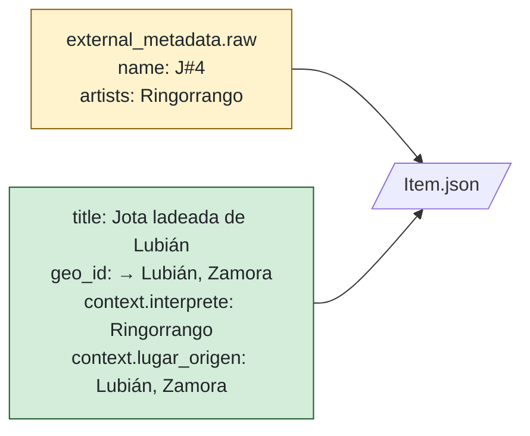

# Caso de uso · Ringorrango — J#4

## El problema

El grupo **Ringorrango** publica en Spotify un disco donde los temas se
llaman `J#1`, `J#2`, …, `J#N`. No hay metadata legible: ni nombre real
de la pieza, ni origen geográfico, ni intérpretes individuales.

Investigando el repertorio (contraste con grabaciones de campo de los 80),
se descubre que `J#4` es la **jota ladeada de Lubián** (Zamora).

!!! question "¿Qué guardar en MATOS?"
    - ¿El título es `J#4` (lo que dice Spotify) o `Jota ladeada de Lubián`
      (lo que dice el archivo)?
    - ¿El origen geográfico es **Madrid** (donde vive el grupo) o **Lubián**
      (origen cultural del repertorio)?
    - Si Spotify cambia el título mañana, ¿perdemos la curación?

## La solución de MATOS

**Dos capas de metadatos coexisten** en el mismo `Item`:



### El JSON resultante

```json title="<uuid>.meta.json"
{
  "id": "…",
  "kind": "url",
  "title": "Jota de los laos (Jota ladeada)",
  "url": "https://open.spotify.com/track/abc123def456",

  "geo_id": "<uuid de Lubián, Zamora>",
  "song_id": "<uuid de la jota ladeada canónica>",

  "context": {
    "interprete": ["Ringorrango"],
    "fecha": "2023",
    "lugar_origen": "Lubián, Zamora"
  },
  "source": {
    "type": "release",
    "release": {
      "platform": "spotify",
      "track_id": "abc123def456",
      "track_number": 4,
      "track_title_external": "J#4",
      "artist": "Ringorrango",
      "release_year": 2023
    }
  },
  "rights": { "license": "all-rights-reserved", "holder": "Ringorrango" },

  "external_metadata": {
    "source": "spotify_api",
    "url": "https://open.spotify.com/track/abc123def456",
    "raw": { "name": "J#4", "artists": [{"name": "Ringorrango"}] },
    "raw_hash": "sha256:…"
  },

  "enrichment": {
    "status": "complete",
    "notes": "Ringorrango codifica títulos como J#1..J#N. Este es la jota ladeada de Lubián; confirmado por contraste con grabación de campo de 1985."
  }
}
```

## Lo que conseguimos

| Pregunta | Respuesta |
|---|---|
| ¿Qué muestra el navegador del archivo? | "Jota ladeada de Lubián" (`title`). |
| ¿Qué se preserva del externo? | `external_metadata.raw.name = "J#4"` y `track_title_external`. |
| ¿Dónde aparece en el mapa? | En **Lubián** (`geo_id`), no en Madrid. |
| ¿Qué pasa si Spotify cambia el title? | `raw_hash` cambia → `enrichment.status = needs_review` → la UI muestra el diff. |
| ¿La curación se pierde? | Nunca: `title`/`geo_id`/`context` viven en otra capa. |

## Por qué importa

Sin esta separación, **o pierdes la verdad del archivo cada vez que refetcheas**,
**o renuncias a la verdad externa**. La doble capa preserva ambas y permite
detectar cuándo la fuente cambia bajo tus pies.
